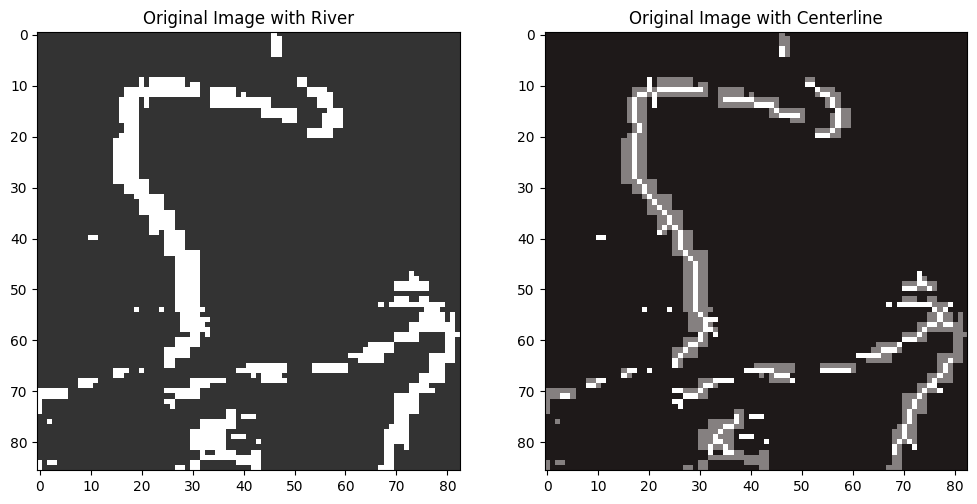

## Modified Medial Axis Transform for River Centerline Extraction and Water-surface Width Estimation (MMATCWE)

<hr style="border: 1px solid black; margin: 0;">

[](https://www.google.com/search?q=https://github.com/yourusername/MMATCWE/releases)
[](https://www.google.com/search?q=https://github.com/yourusername/MMATCWE/issues)
[](https://opensource.org/licenses/MIT)
[](https://hits.seeyoufarm.com)
[](https://www.google.com/search?q=https://badge.fury.io/py/mmatcwe)
[](https://www.google.com/search?q=https://pepy.tech/projects/mmatcwe)

| | |
| --- | --- |
| <a href="[https://yourwebsite.com](https://thapawan.github.io/)"></a> | This repository provides a user-friendly Python package and source code for the automatic extraction of river centerlines and estimation of water-surface widths from raster imagery. It is developed by [Pawan Thapa/University of Alabama], [Department of Geography and the Environment], United States. |

### **Background**

<hr style="border: 1px solid black; margin: 0;">

Accurate river centerline extraction and water-surface width estimation are crucial for hydrological modeling, river morphology studies, and environmental monitoring. Traditional methods can be time-consuming and require manual intervention, especially when dealing with large datasets or complex river geometries.

To address these challenges, we developed the Modified Medial Axis Transform for River Centerline Extraction and Water-surface Width Estimation (MMATCWE). This Python-based package automates the process of extracting river centerlines and estimating water-surface widths from raster images, leveraging a modified medial axis transform approach. It provides robust and efficient tools for processing various types of river imagery.

### **Repository Structure**

<hr style="border: 1px solid black; margin: 0;">

The architecture of `mmatcwe` integrates key modules for image processing, medial axis transformation, and width estimation. All module codes are in the source (`src`) folder.

```bash
mmatcwe/
├── docs/
│   └── sampledata/
│   └── mmatcwe_usage.ipynb
├── Images/
│   └── flowchart.jpg
│   └── directorystructure.png
├── src/
│   └── mmatcwe/
│       ├── centerline_extraction.py
│       ├── width_estimation.py
│       ├── utils.py
│       └── __init__.py
├── tests/
│   └── test_mmatcwe.py
├── setup.py
├── README.md
└── LICENSE
```

The graphical representation of the `mmatcwe` pipeline can be summarized as follows in **Figure 1**. It shows the interconnected steps within `mmatcwe` for automated river centerline extraction and width estimation.

<div align="center">
  
</div>
Figure 1: Flowchart showing the MMATCWE pipeline.

### **Framework Installation and Usage**

<hr style="border: 1px solid black; margin: 0;">

This framework is published as a Python package on PyPI ([https://pypi.org/project/mmatcwe/](https://www.google.com/search?q=https://pypi.org/project/mmatcwe/)). Install the package using `pip` and import it into your workflows:

```bash
# Install the framework
pip install mmatcwe

# Use the framework in your workflows using poetry
poetry add mmatcwe
```

Import the package into your Jupyter Notebook or Python IDE:

```python
# Import the package
import mmatcwe as mc
```

**Note: Detailed usage instructions and examples are provided in [docs/mmatcwe\_usage.ipynb](./docs/mmatcwe_usage.ipynb).**

#### **Main Directory Structure**

The main directory should contain the raster images for processing. If you have multiple river segments or study areas, organize them into subfolders within the main directory.

```bash
main_dir = Path('./path/to/main/dir')
```

#### **Executing the MMATCWE Framework**

The `mmatcwe` framework provides modules for centerline extraction and width estimation.

Table 1: Modules in `mmatcwe`.

| Module Name | Objective | Arguments | Outputs |
|------------|-----------|-----------|-----------|
| `extract_centerline` | Extracts the river centerline from a raster image. | `raster_path`: Path to the raster image, `spatial_resolution`: Spatial resolution of the raster. | GeoDataFrame containing the centerline geometry. |
| `estimate_width` | Estimates the water-surface width along the extracted centerline. | `raster_path`: Path to the raster image, `centerline_gdf`: GeoDataFrame containing the centerline. | DataFrame containing width estimates along the centerline. |

<p align="center">
  
</p>

Figure 2: Example output from MMATCWE.

### **Acknowledgements**

| | |
| --- | --- |
| \! | [Add any acknowledgements here] |

### **For More Information**

Contact [Pawan Thapa/[Contact Information](https://geography.ua.edu/graduate-student/thapa-pawan/)] for more details.


